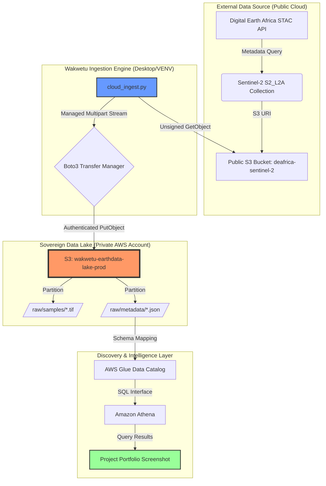

# Wakwetu Earth-Data Ingestion Engine 🌍

An enterprise-grade, sovereign geospatial data lakehouse designed for the resilient ingestion and discovery of high-resolution satellite imagery. This engine bridges public research archives (Digital Earth Africa) with private, governed AWS infrastructure.

---

## 🏗️ System Architecture & Workflow

---

## 🛠️ Technical Implementation
* **Infrastructure as Code:** Fully provisioned via Terraform, including S3 Datalake partitions and IAM Security Policies.
* **Resilient Ingestion:** Custom Python engine utilizing `boto3` managed multipart transfers to overcome regional latency (Oregon to Virginia).
* **Discovery Layer:** Serverless SQL analytics via Amazon Athena and AWS Glue, enabling rapid metadata elicitation.
* **Geospatial Assets:** Successfully secured **207.9 MiB** of Sentinel-2 L2A COG data for the Nairobi strategic region.

## 📁 Project Structure
* `infra/aws/`: Terraform configurations for the Sovereign Perimeter.
* `backend/src/`: Python ingestion logic and transfer handlers.
* `docs/evidence/`: Physical verification logs and system screenshots.
* `cloud_ingest.py`: The core bridge execution script.

## 📊 Physical Evidence (Verification)
1. **00_terraform_provisioning_success.png**: Proof of automated infrastructure deployment.
2. **01_ingestion_success_physical.png**: S3 verification of the 207.9 MiB binary asset.
3. **02_athena_discovery_success.png**: SQL proof of metadata searchability and discovery.

---

## ⚖️ Governance & Sovereignty
This project implements **Zero-Inference Rule** protocols for data handling and ensures that all environmental assets are held in sovereign, encrypted storage, independent of external provider availability.

---
**Lead Architect / Project Manager:** Dan Alwende
**Organization:** Wakwetu Earth-Data Systems
