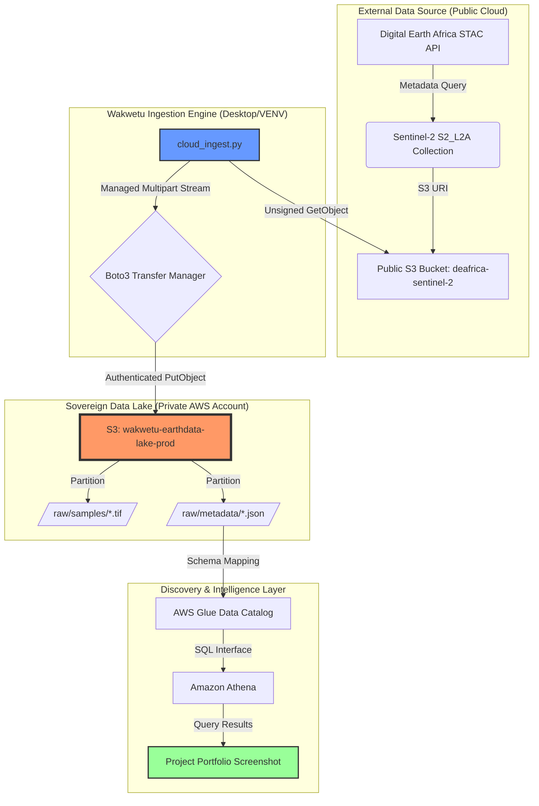

# Wakwetu Earth-Data Ingestion Engine 🌍

## System Architecture Workflow

```mermaid
graph TD
    subgraph "External Data Source (Public Cloud)"
        A[Digital Earth Africa STAC API] -->|Metadata Query| B(Sentinel-2 S2_L2A Collection)
        B -->|S3 URI| C[Public S3 Bucket: deafrica-sentinel-2]
    end

    subgraph "Wakwetu Ingestion Engine (Desktop/VENV)"
        D[cloud_ingest.py] -->|Unsigned GetObject| C
        D -->|Managed Multipart Stream| E{Boto3 Transfer Manager}
    end

    subgraph "Sovereign Data Lake (Private AWS Account)"
        E -->|Authenticated PutObject| F[S3: wakwetu-earthdata-lake-prod]
        F -->|Partition| G[/raw/samples/*.tif/]
        F -->|Partition| H[/raw/metadata/*.json/]
    end

    subgraph "Discovery & Intelligence Layer"
        H -->|Schema Mapping| I[AWS Glue Data Catalog]
        I -->|SQL Interface| J[Amazon Athena]
        J -->|Query Results| K[Project Portfolio Screenshot]
    end

    style F fill:#f96,stroke:#333,stroke-width:4px
    style D fill:#69f,stroke:#333,stroke-width:2px
    style K fill:#9f9,stroke:#333,stroke-width:2px
```

## Physical Evidence
* **Data Ingested:** 207.9 MiB GeoTIFF
* **Discovery:** Athena SQL Metadata Verified
